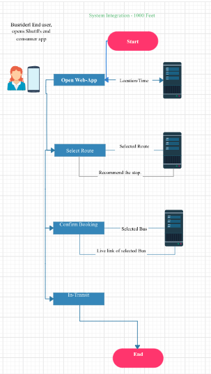

# TechTeam_returns - Transport

## Project Overview
----------------------------------

### Problem Statement
----------------------------------
**Link to deployed project: https://busrider.herokuapp.com/ **

* How to make people use public transport more and also promote carpooling

The solution that we came up with is an BusRider- an web-app which keeps track of the number of Passengers travelling on the bus.

### Solution Description

* The BusRider app is an app which keeps track of the track of number of passengers in the bus.
* It also helps to maintain an online ticketing system for both the passengers and the driver.
* It also tells what bus to take to travel each route 

#### Architecture Diagram

#### Technical Description

Software Required:- 
* Python3, Flask, HTML, SQLite3

### Team Members
----------------------------------

Shoumik Dey  - shoumikdey123@gmail.com\
Arya Das     - aryadas98@gmail.com\
Rishab Ghosh - rishabghosh1222@gmail.com
